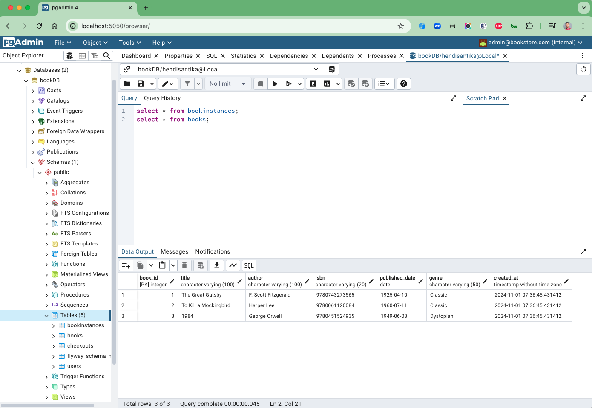
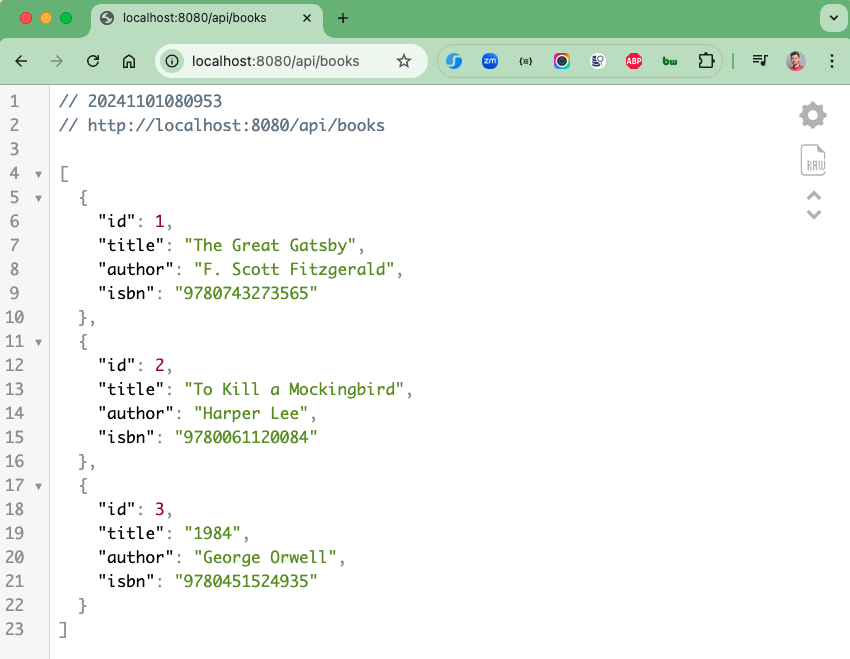
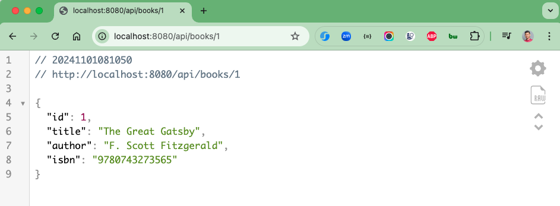

# spring-boot-books
### Things todo list
1. Clone this repository: `git clone https://github.com/hendisantika/spring-boot-books.git`
2. Navigate to the folder: `cd spring-boot-books`
3. Run the application: `mvn clean spring-boot:run`
4. Open your favorite browser: http://localhost:5050
5. Open your favorite browser: http://localhost:8080/api/books
6. Open your favorite browser: http://localhost:8080/api/books/{id}

### Image Screenshot

PgAdmin Page

List Books Page

Find Book by Id

